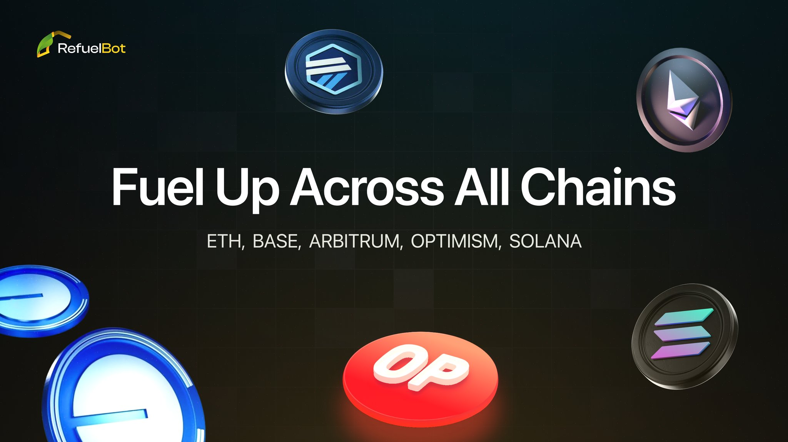
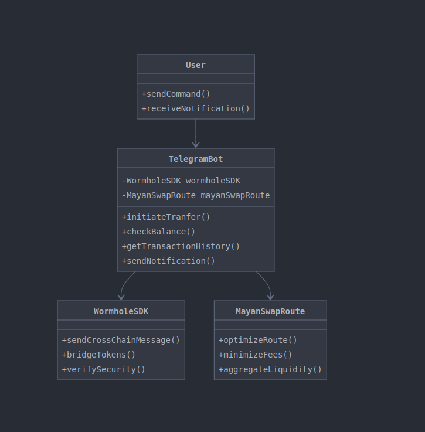

# Refuel Bot (Wormhole SDK & Mayan Route Bridge)

Welcome to Refuel Bot, an advanced Telegram bot designed to streamline cross-chain asset transfers between EVM-compatible chains and Solana. By leveraging the Wormhole SDK and Mayan Route Bridge, Refuel Bot ensures seamless and efficient token bridging across different blockchain ecosystems.

## Key Features

1. **Wormhole SDK Integration**: Utilizes the powerful Wormhole protocol for secure and fast cross-chain transfers.
2. **Mayan Route Bridge**: Implements the Mayan Route Bridge for optimized paths between EVM chains and Solana.
3. **Telegram Interface**: Provides an easy-to-use Telegram bot interface for initiating and managing transfers.
4. **Multi-Chain Support**: Supports multiple EVM-compatible chains and Solana.
5. **Real-time Transaction Tracking**: Offers live updates on the status of your cross-chain transfers.

## How It Works

### Wormhole SDK

The Wormhole SDK is at the core of Refuel Bot's functionality. It enables:

- **Cross-Chain Messaging**: Facilitates communication between different blockchain networks.
- **Token Bridging**: Allows for the seamless transfer of tokens across supported chains.
- **Security**: Implements robust security measures to ensure the safety of cross-chain transfers.

### Mayan Route Bridge

Mayan Route Bridge optimizes the transfer process by:

- **Route Optimization**: Finds the most efficient path for token transfers between EVM chains and Solana.
- **Fee Minimization**: Reduces overall transaction costs by selecting the best routes.
- **Liquidity Aggregation**: Utilizes multiple liquidity sources to ensure smooth transfers.

### Telegram Bot Interface

The Telegram bot provides a user-friendly interface for:

- **Initiating Transfers**: Start cross-chain transfers with simple commands.
- **Checking Balances**: View your token balances across different chains.
- **Transaction History**: Access a log of your past transfers and their statuses.
- **Real-time Notifications**: Receive updates on the progress of your transfers.

## Getting Started

To start using Refuel Bot, follow these steps:

1. **Add the Bot**: Search for [@RefuelPreciumbot](https://t.me/RefuelPreciumbot) on Telegram and start a chat.
2. **Connect Wallets**: Link your EVM and Solana wallets using the bot's secure connection process.
3. **Select Chains**: Choose the source and destination chains for your transfer.
4. **Initiate Transfer**: Use the bot commands to start your cross-chain asset transfer.
5. **Confirm and Track**: Confirm the transaction details and track its progress through the bot's updates.

## Supported Chains

- EVM-compatible chains: Ethereum, Binance Smart Chain, Polygon, Avalanche, etc.
- Solana

## Security Measures

- End-to-end encryption for all communications
- Non-custodial design: Refuel Bot never holds your private keys
- Regular security audits of the underlying protocols

## Future Developments

- Integration with more blockchain networks
- Advanced trading features like limit orders and swap optimization
- Mobile app for enhanced user experience

## Contributing

We welcome contributions to improve Refuel Bot! Feel free to open an issue or submit a pull request on our GitHub repository.

## License

This project is licensed under the MIT License.

---

Check out our live bot on Telegram: [@RefuelPreciumbot](https://t.me/RefuelPreciumbot)

For more information and updates, visit our website: [https://refeulbot.xyz/](https://refeulbot.xyz/)

## Figma Design

Check out the design of the Refuel Bot Telegram interface on Figma [here](https://www.figma.com/design/d12Rj28pGcmxliEXWLhuD0?node-id=).
